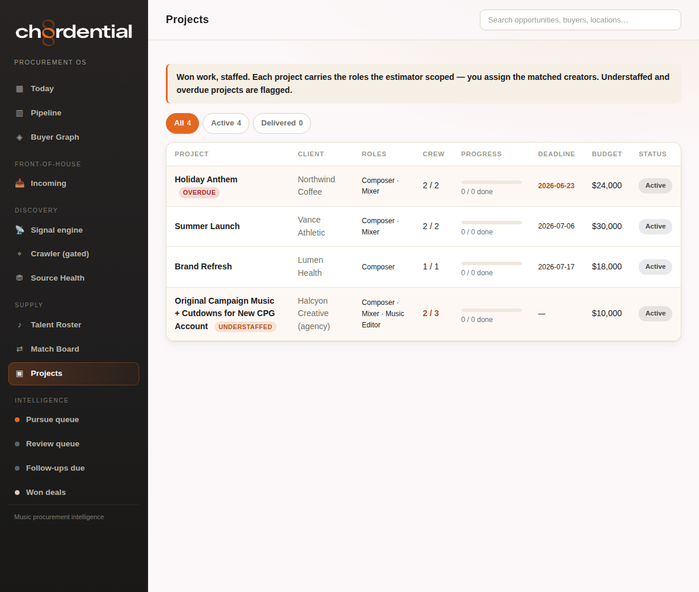
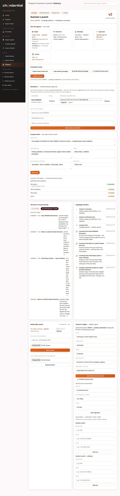
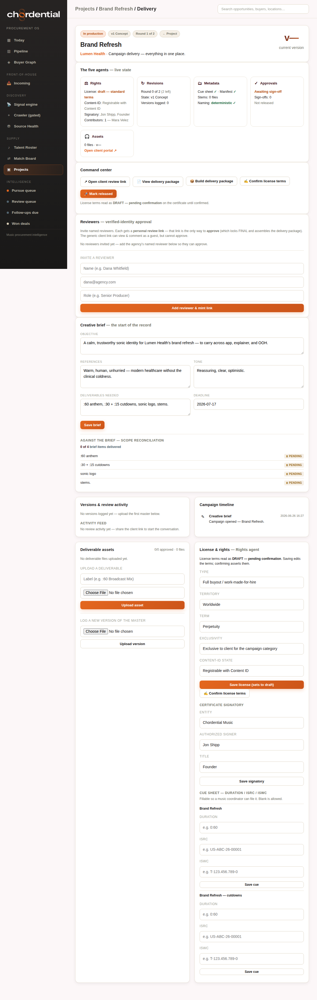
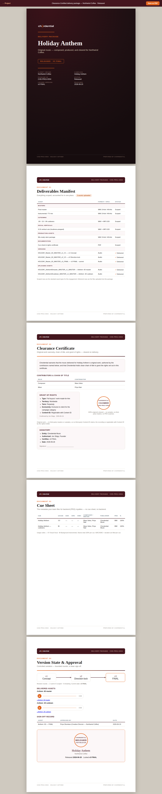
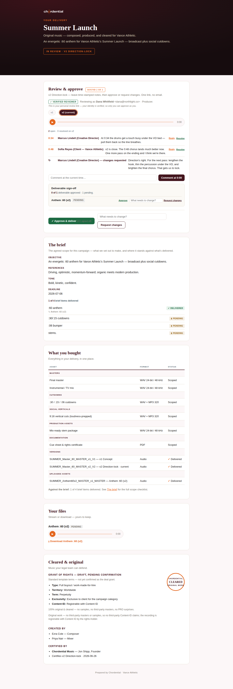
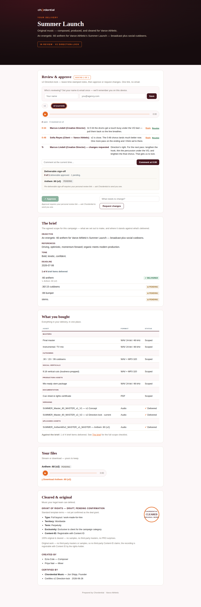
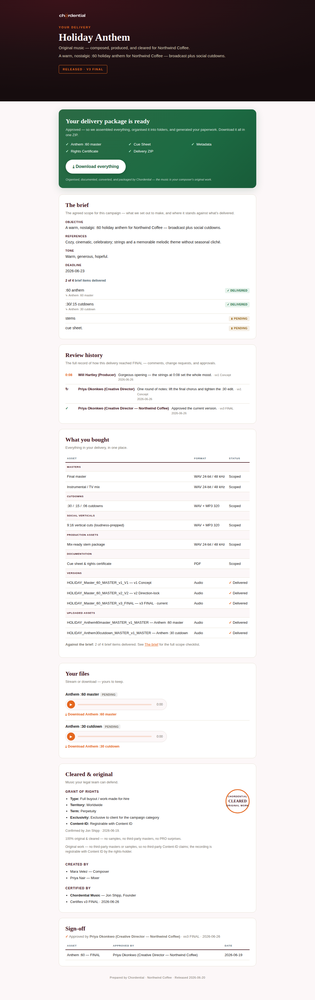

# Chordential Delivery OS — User Manual

*How to run a campaign from brief to final delivery. Two audiences: the **Operator**
(you/Chordential) and the **Agency Reviewer** (your client). Screens below are from
the live system with the demo campaigns on.*

---

## What this is, in one minute

The Delivery OS replaces the email-and-attachments chaos of delivering music with
**one link per campaign**. The agency reviews every version in one place with
time-stamped comments, approves with a click, and the instant they approve, the
**delivery package assembles itself** — files, cue sheet, rights certificate,
metadata, all zipped — and they download everything. You stay in control: you upload,
you set terms, you press the human buttons; the system does the busywork.

It's organized as **five "agents,"** each owning one part of the job:
**⚖ Rights · ↻ Revisions · 🗂 Metadata · ✓ Approvals · 🎧 Assets** — all visible on
one screen.

---

## Before you start — what you're looking at

> **The screenshots in this manual show a fully set-up *example* campaign** ("Vance
> Athletic," at version v2, with comments and reviewers already in place). **Your own
> campaigns start empty** and fill in as you complete the steps below — so if a new
> project shows no version ("v—"), no comments, and an empty checklist, that's normal:
> you just haven't uploaded a master or added a brief *yet*.
>
> **To click through the exact example campaigns pictured here**, turn on demo mode: in
> **Render → your service → Environment**, add `CHORDENTIAL_SEED_DEMO` = `1`, save, and
> let it redeploy. The *Lumen Health*, *Vance Athletic*, and *Northwind Coffee*
> campaigns then appear, fully populated. Set it back off to return to your real data
> only. (Production hides demo data on purpose — it shows *your* campaigns, not samples.)

---

# Part 1 — For the Operator (you)

## 1.1 Find your campaigns

Log in to Chordential (the admin side — the same place as your **Today** and
**Pipeline** dashboard) and open **Projects** in the left nav. Every won deal that
you've spun up a project for lives here. On your live site this list is **your real
projects only** — it starts empty until you create one (win an opportunity →
**"spin up project"**). The demo campaigns pictured throughout this manual — **Lumen
Health** (just briefed), **Vance Athletic** (in review), **Northwind Coffee**
(delivered) — appear only when demo mode is on (see "Before you start" above).

Click a campaign to open its **project page**, then click the **"Delivery console →"**
link at the top of that page to open its command center. (The link lives on the project
page, not on the Projects list itself.)

## 1.2 The Delivery Console — your one screen

This is where you run the whole campaign. Everything below is one page.

Top to bottom:

- **The five agents** — a status strip: Rights (license state), Revisions (which round
  / version), Metadata (cue sheet + manifest), Approvals (sign-off), Assets (file
  count). A glance tells you where the campaign stands.
- **Command center** — the action buttons, in order: **↗ Open client review link**,
  **📄 View delivery package**, **📦 Build delivery package**, **✍ Confirm license
  terms** (only shown until the license is confirmed), and **🚀 Mark released**. The
  "Open client review link" button only appears once a share token exists for the
  project (it's minted automatically the first time the console loads).
- **Reviewers** — invite the people allowed to approve (see 1.4).
- **Creative brief** — the agreed scope (see 1.3).
- **Against the brief** — a live checklist reconciling what the brief asked for vs.
  what you've delivered.
- **Versions & review activity** + **Campaign timeline** — every version, comment,
  change request and approval, in order.
- **Deliverable assets** — upload files and new versions; set each file's folder.
- **License & rights** — set the grant, confirm it, name the signatory, add cue-sheet
  metadata (ISRC/ISWC).

## 1.3 Write the creative brief

The brief opens the record and becomes the **contract** the agency sees. In the
**Creative brief** card, fill in **Objective**, **References**, **Tone**, **Deliverables
needed**, and **Deadline**, then press **Save brief**. The deliverables you list are
matched (by keyword) against the files you deliver, so both sides can see scope
completion — a rollup reads e.g. "**3 of 5** brief items delivered," with each item
tagged ✓ Delivered or ⧗ Pending in the **Against the brief** checklist directly below
the form.

> Gotcha: blank brief fields fall back to a default seeded from the original
> opportunity — so a field you clear and save doesn't go empty, it reverts to that
> default. The scope checklist only appears once the brief lists deliverables.

A brand-new campaign starts here, with no versions yet:

## 1.4 Invite reviewers (this is how approval is kept safe)

In the **Reviewers** card, fill in the **Invite a reviewer** fields (name, email, role)
and press **Add reviewer & mint link**. Each invited reviewer appears in a table with
their **personal review link** (a `?r=…` URL) — use the **Copy link** button (or
**Open ↗**) and send that link to them. **Remove** revokes a reviewer (their link stops
working).

- Anyone with the plain campaign link (the `?k=…` share link from "Open client review
  link") can *view and comment* as a guest.
- **Only an invited reviewer, opening their own personal `?r=` link, can approve** —
  both the whole-campaign **✓ Approve & deliver** and per-deliverable sign-off (which
  lock the final version and build the package). A guest sees the Approve button
  disabled. This stops a stray link-holder from approving as a made-up name.

> Note: email + role are optional when inviting, but a reviewer with no email still
> can't be reached unless you send them the link manually — there's no auto-email yet
> (see 1.6).

## 1.5 Upload a version for review

The **Deliverable assets** card has **two** upload forms — don't mix them up:

- **Log a new version of the master** (button: **Upload version**) — this is how you
  put the current cut up for review. Each upload advances the version ladder (v1
  Concept → v2 Direction-lock → v3 FINAL) and the agency always sees which version
  they're on. Logging a new version after a campaign was already Approved/Delivered
  **reopens it to "In review"** (the prior approval no longer stands).
- **Upload a deliverable** (button: **Upload asset**) — for the individual files that
  go in the final package (the :30 cutdown, stems, etc.), each with an optional
  **Label**. These show up as rows you can approve/sign-off on and file into folders.

So: the *master under review* goes through **Upload version**; everything else that
ships in the ZIP goes through **Upload asset**.

## 1.6 Share the review link & watch the activity

Press **↗ Open client review link** (the share/`?k=` link — view + comment only), or
send a reviewer their personal `?r=` link (the only link that can approve). As the
agency comments, requests changes, approves files, or approves the campaign, you get a
**phone notification** (best-effort, if push is configured), and every action lands in
the **Versions & review activity** feed and the **Campaign timeline**.

> Note: you're notified when the agency acts. Auto-*emailing the agency* when you post
> a new version needs an email service connected (not on yet) — for now, send them
> their link directly.

## 1.7 Set & confirm the license, name the signatory

In the **License & rights** card:

1. Set the grant (**Type**, **Territory**, **Term**, **Exclusivity**, **Content-ID
   state**) and press **Save license (sets to draft)**. Saving leaves the terms as a
   *draft* — on the certificate they read **"DRAFT — pending confirmation."**
2. Set the **Certificate signatory** (**Entity**, **Authorized signer**, **Title**) and
   press **Save signatory** — this is who stands behind the clearance, tied to the
   certified version.
3. Press **✍ Confirm license terms** (available both here and in the Command center) to
   lock the grant. The Confirm button auto-fills the confirming name from the
   signatory's *signer*, so set the signatory **before** confirming.

Until the license is confirmed you **cannot release** — the deliberate guard so nothing
ships with an unconfirmed, silently-assumed buyout.

> Gotcha: **editing and re-saving the license un-confirms it.** Any later **Save
> license** clears a prior confirmation (the new terms must be confirmed again), so do
> your license edits first, then confirm last.

## 1.8 The delivery package assembles itself

When the agency **approves** (via their personal link), the system automatically builds
the **delivery package**: your uploaded files organized into named folders (Masters /
Cutdowns / Social / Stems / Docs / Other), plus an auto-generated **cue sheet**,
**metadata**, and **rights certificate** — all zipped. You can also press **📦 Build
delivery package** yourself to (re)build it after assets or versions change — same
automation, idempotent. A "Last package: …" line on the Command center shows the most
recent build and links the ZIP.

> Note: **approval happens on the agency's side**, not yours — the console shows
> per-deliverable approval status read-only (the ✓ Approved / ↻ Changes / Pending
> badges and the N/M rollup), but you don't approve from the console. Use **Build
> delivery package** when you want to assemble the ZIP yourself.

The generated, on-brand package (this is also your proof-of-concept artifact):

## 1.9 Release

Once the license is confirmed and you're happy, press **🚀 Mark released**. The campaign
moves to Released; the full review history is preserved for provenance.

> Gotcha: if you press **Mark released** before confirming the license, you get a
> browser confirm warning, and even if you click through, the server **refuses** the
> release and bounces you back with a red "Release refused — confirm the license terms
> first" banner. Confirm the license, then release.

---

# Part 2 — For the Agency Reviewer (your client)

## 2.1 Open the link

You get one link per campaign — no account, no attachments. Open it and you see the
campaign, the brief, the version under review, and everything in one place.

**Guest vs. personal link:** with the plain link (`?k=…`) you can listen and comment —
the first time, set your **name and email** once in the "Who's reviewing?" box and the
page remembers you on this device. To **approve**, use the **personal review link**
(`?r=…`) Chordential sent you — on that link your name + email are taken from the
reviewer roster, shown as a green **"✓ Verified reviewer"** badge, and locked (you
can't retype them), so your approval is real and attributable.

The reviewer view (verified — note the locked identity and the ability to approve):

## 2.2 See what was agreed (the brief)

**The brief** card shows the objective, references, tone, and deadline you signed off
on — the contract for this work. The **scope checklist** shows each promised
deliverable as ✓ Delivered or ⧗ Pending, so you always know what's outstanding.

## 2.3 Play the version & navigate versions

Press play on the version under review. The **version rail** (v1 · v2 · v3) shows which
version you're on — the latest chip is marked **(current)**; click any earlier chip to
open and play that round and read *its* notes (it's marked **(viewing)**, with a "Back
to current" link). So nobody ever reviews the wrong cut again.

## 2.4 Leave time-stamped comments

Play the track, then type in the **"Comment at the current time…"** box and press
**Comment at 0:34** — the note pins to wherever the playhead is ("0:34 — strings should
swell here"). Click any timecode to jump back to it. Each note has a **Reply** toggle
(replies thread under the parent and carry no timecode of their own) and a
**Resolve / Reopen** toggle once it's handled. An "**N open · M resolved**" count sits
above the notes. Everyone sees the same thread; no email needed.

The guest view shows the same review experience (comment freely; approval asks for your
personal link):

## 2.5 Approve files individually, or the whole campaign

In the **Deliverable sign-off** block you can **Approve** or **Request changes** on
**each deliverable** (approve the :60 master, ask for a tweak on the :30 cutdown) — a
"3 of 4 deliverables approved" rollup tracks it. When you're ready, press the green
**✓ Approve & deliver** button at the bottom (it shows the "(N/M signed off)" count).
If some deliverables aren't approved yet, a confirm dialog warns you before it locks the
version as FINAL and assembles the package.

> Per-deliverable Approve/Request-changes and the **✓ Approve & deliver** button only
> appear on a **personal review link**. On a guest (share) link the per-deliverable
> sign-off is read-only and the campaign Approve button is greyed out with a note to
> ask Chordential for your personal link. **Request changes** (the whole-version note
> box) is available to guests too.

## 2.6 Approve → get everything

The moment you approve, the package is built and a green **"Your delivery package is
ready"** card appears with a **⤓ Download everything** button. One button, the whole
campaign: masters, cutdowns, stems, cue sheet, rights certificate, metadata, zipped and
organized. (The Review & approve panel disappears once the campaign is Delivered/
Released — the page is now your delivery, not a review.)

Your full comment and approval history stays on the page for the record.

---

# Part 3 — Reference

- **Campaign states:** *In production* → *In review* → *Approved/Delivered* →
  *Released*.
- **Version labels:** v1 Concept · v2 Direction-lock · v3 FINAL.
- **What's in the delivery ZIP:** your uploaded files (in Masters / Cutdowns / Social /
  Stems / Other / your assigned folders) + `Docs/` (cue_sheet.csv, metadata.json,
  rights_certificate.txt, manifest.txt). Files referenced by link (not uploaded) are
  noted in `Docs/README.txt`. On the console you can set each file's folder with the
  per-asset **Folder** dropdown (defaults to "auto," a keyword guess); referenced-only
  files can't be filed (nothing to bundle) and show "referenced only."
- **The honest line:** the system organizes, documents, converts, packages, and
  delivers. The music itself is always yours/your composer's — nothing is AI-generated.
- **Rights, today:** the certificate is *documented & original* (chain of title,
  license grant, Content-ID status, signatory). Indemnification is intentionally **not**
  promised yet.
- **Known limits:** files are stored locally (durable cloud storage is a later add);
  the agency isn't auto-emailed on new versions (needs an email service); approval is
  gated by invited-reviewer links, not full accounts.

---

## Dana's manual-review notes

I walked the manual section by section against the live console, portal, and routes.
The substantive corrections I made:

- **Fixed wrong/imprecise button names throughout.** The big one: 1.5 told you to press
  "Upload a new version of the master" — there's no such button. The console has *two*
  forms: **Log a new version of the master** (button **Upload version**) for the cut
  under review, and **Upload a deliverable** (button **Upload asset**) for the files
  that ship in the ZIP. I split them out so a first-timer doesn't upload a stem as a new
  master round. Also corrected: **Save license (sets to draft)**, **Save signatory**,
  **Add reviewer & mint link**, **Copy link**, the agency's **✓ Approve & deliver** and
  **Deliverable sign-off**, and the **⤓ Download everything** payoff.
- **Corrected the "Delivery console →" entry point.** That link is on the *project
  page*, not the Projects list — clarified the click path.
- **Named the demo campaigns** (Lumen Health / Vance Athletic / Northwind Coffee) so a
  reviewer walking demo mode knows which is which (just-briefed / in-review / delivered).
- **Spelled out guest vs. personal-link mechanics** — `?k=` vs `?r=`, the locked
  verified-reviewer identity, and exactly which controls a guest *can't* use (campaign
  Approve and per-deliverable sign-off are personal-link-only; whole-version Request
  changes is open to guests).
- **Added the gotchas a first-timer actually hits:** saving the license **un-confirms**
  it (so confirm last); **Confirm license terms** auto-fills the confirmer from the
  signatory's signer (so set the signatory first); **Mark released** is refused
  server-side until the license is confirmed (with the red banner); logging a new
  version **reopens** an already-Delivered campaign to review.
- **Clarified that the operator doesn't approve from the console** — per-deliverable
  status there is read-only; approval is the agency's action. Build delivery package is
  the operator's manual (re)build.
- **Reference fixes:** added the **Other** ZIP folder and the per-asset **Folder**
  dropdown; clarified version-rail "(current)/(viewing)" and the timecoded-comment flow
  (Reply threads, Resolve/Reopen, open/resolved count).

Suggestions that need a **product change**, not just a doc fix:

- **Two upload forms on one card is a usability trap.** "Upload a deliverable" and
  "Log a new version of the master" sit one above the other and look identical; the only
  difference is one button says *Upload asset* and the other *Upload version*. A clearer
  visual split (or a single "what are you uploading?" toggle) would let me delete a whole
  paragraph of warning.
- **The legacy operator-side `/delivery/approve` route has no UI** but still exists and
  records `approver`/`asset` sign-offs that surface in the console's "Sign-offs" table.
  It's confusing that approvals can come from two shapes (agency `review/asset` vs this
  orphaned route). Either wire it to a visible control or retire it.
- **"Confirm license terms" appears in two places** (Command center *and* the License &
  rights card) doing the same thing — fine, but worth one canonical home to avoid
  "which button do I press."
- **No auto-email to the agency on a new version** remains the biggest workflow gap: the
  operator must copy/paste links by hand. Until the outbound-email channel lands, every
  "share the link" instruction is a manual step. Flagged in the doc, but it's a real
  product TODO.
